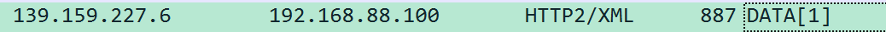
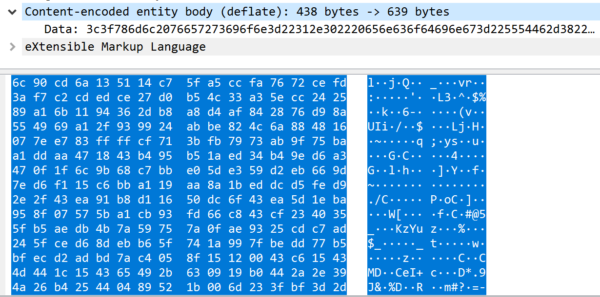
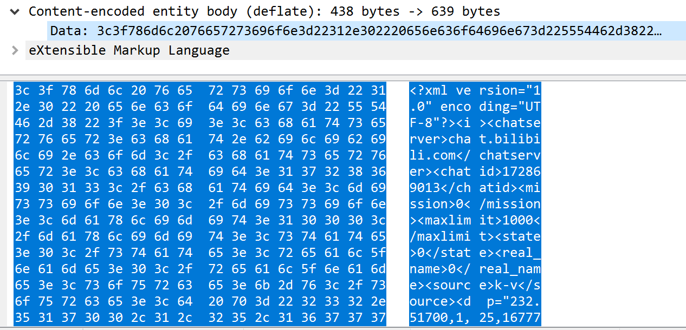

## 记录一次使用 Golang 获取 Bilibili(B站) 弹幕

注意！  
这里有一个大坑，害我弄了好久，也是为什么会记录下来

首先说明：弹幕API 请求是 HTTP/2， Body 是 deflate 算法压缩的  
问题也在这：`net/http` 请求之后却没有对 Body 进行解压缩，直接就返回数据，导致出现乱码

一开始发现问题时，用 **Fiddler** 抓包，由于 **Fiddler** 不支持 **HTTP/2**，所以 **Fiddler** 对请求进行处理，结果就是能正确获取内容，一旦关掉 **Fiddler**，又变成乱码  
搞来搞去也搞不出个所以然

后来不得不上 **Wireshark**，发现该请求是 **HTTP/2**  
接着发现软件显示 `Content-encoded entity body(deflate)`，其16进制内容就是上面 Body 的16进制  
并且 **Wireshark** 也给出了解码后的内容，就是正确的弹幕内容  
经过搜索，发现是 deflate算法压缩了，但是 `net/http` 却没有进行解压缩，导致出现这个问题

所以只需要对 Body 进行 deflate解压就行

代码如下:
```
package main

import (
	"compress/flate"
	"fmt"
	"io/ioutil"
	"net/http"
)

func main() {
	cid := "此处填写cid号"
	u := "https://comment.bilibili.com/" + cid + ".xml"
	resp, _ := http.Get(u)
	defer resp.Body.Close()
	df := flate.NewReader(resp.Body)
	defer df.Close()
	b, _ := ioutil.ReadAll(df) // b 就是解压后的数据
	fmt.Println(string(b))
}

```

请求为 HTTP/2:


解压前数据:


解压后数据:

